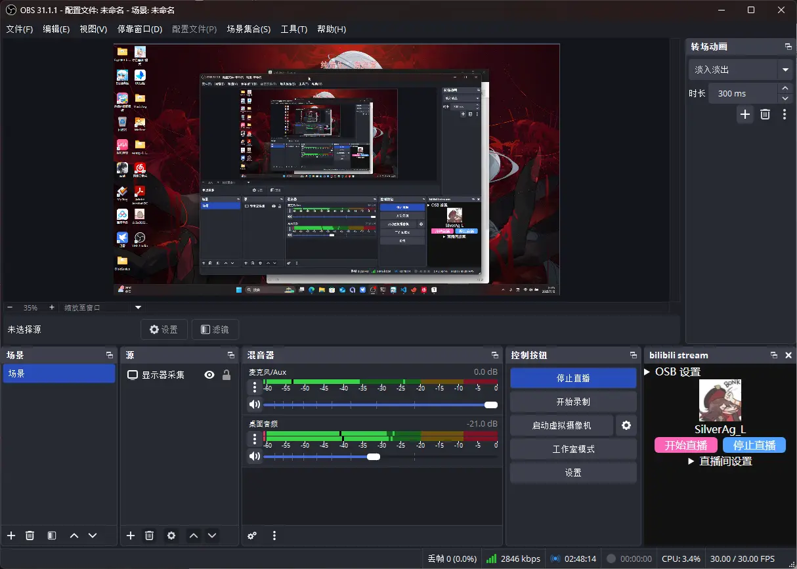
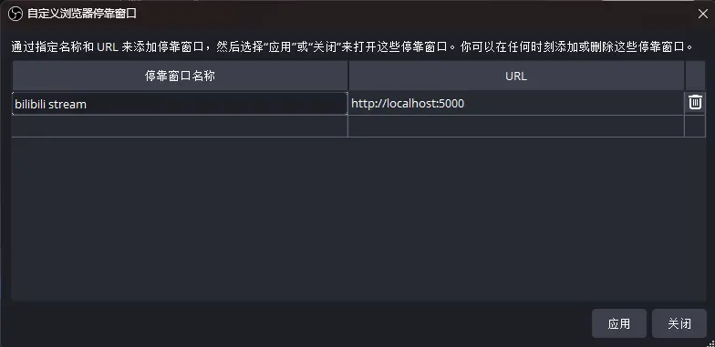
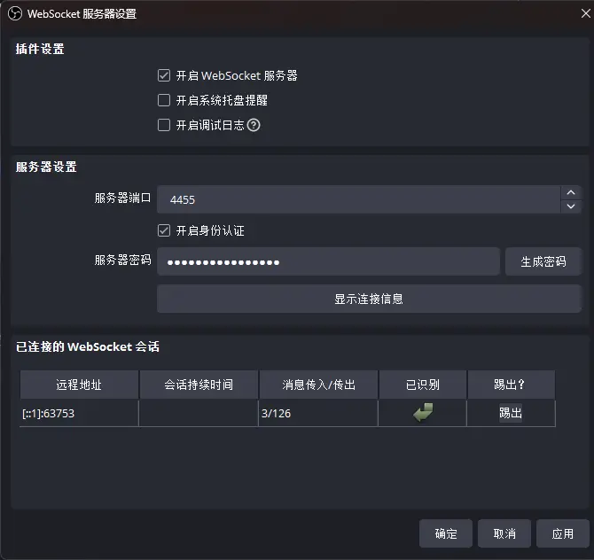

# BiliLive.Observer：OBS Bilibili 开播插件

用于嵌入 OBS 中实现一站式 B 站开播。债见，Bilibili 直播姬（



## Usage 食用方法

[下崽指路](https://github.com/frg2089/BiliLive.Observer/releases/latest)

另需依赖：[ASP.NET Core 9.0](https://dotnet.microsoft.com/zh-cn/download/dotnet/thank-you/runtime-aspnetcore-9.0.7-windows-hosting-bundle-installer) ←点击下载安装运行时整合包 :)

---

下载解压`BiliLive.Observer.zip`，双击运行`BiliLive.Service.exe`，不出意外应该能看到如下日志：

```log
info: Microsoft.Hosting.Lifetime[14]
      Now listening on: http://localhost:5000
info: Microsoft.Hosting.Lifetime[0]
      Application started. Press Ctrl+C to shut down.
info: Microsoft.Hosting.Lifetime[0]
      Hosting environment: Production
info: Microsoft.Hosting.Lifetime[0]
      Content root path: ...
```

> [!tip]
> 现在也可以在 OBS 的“工具”→“脚本”里添加`BiliLive.Observer.lua`脚本，这样它就可以跟随 OBS 自动运行了。

默认情况下插件会使用 5000 端口。你可以直接在浏览器访问`http://localhost:5000`检验下服务是否成功启动。

---

接下来打开 OBS。以`v31.1.1`版本为例：在菜单栏找到“停靠窗口”，点击里边的“自定义浏览器停靠窗口”，为这项服务新增停靠窗口：



点击应用，初次添置应该就能看到一个悬浮窗口显示登录 B 站的二维码（

> [!warning]
> 由于 CEF 兼容性原因，在 Wayland 合成器（Linux）里运行 OBS 时无法“自定义浏览器停靠窗口”。我个人还是用`electron`作为 workaround 了。

接下来需要配置 OBS WebSocket。菜单栏里找到“工具”→“WebSocket 服务器设置”，**首先启用 WebSocket**，然后“显示连接信息”，进去复制服务器密码。

开启 WebSocket 服务之后，点开插件的 OBS 设置，把刚刚的密码粘贴进去，点击连接。重新回到 WebSocket 服务器设置，这时应能看到一个已连接的 WebSocket 会话。



然后扫码登录 Bilibili 账号，点开“直播间设置”，选好直播分区，“更新设置”，于是就可以开播辣。

## Inspirations 灵感菇

- [ChaceQC/bilibili_live_stream_code](https://github.com/ChaceQC/bilibili_live_stream_code)
- [xfgryujk/blivechat](https://github.com/xfgryujk/blivechat)

## Credits 鸣谢

- [@AgxCOy](https://github.com/AgxCOy)：测试
